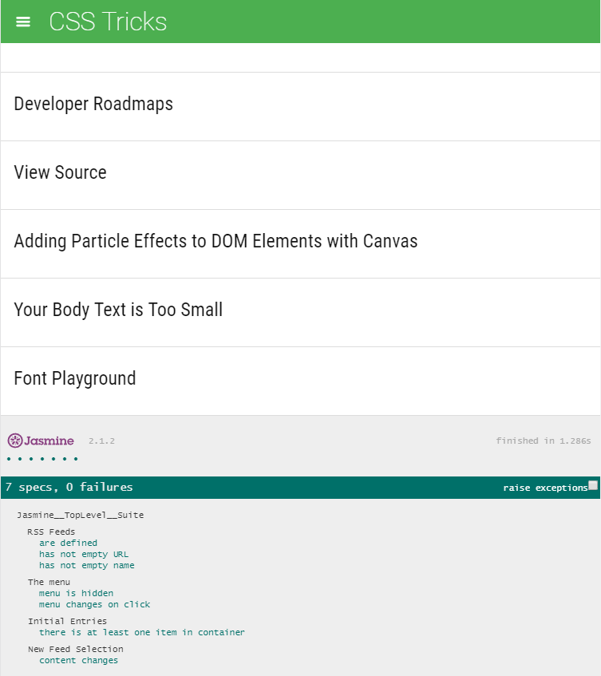

# Feed Reader Project

## What is Feed Reader Project

This project is meant to introduce me to unit testing using Jasmine framework.
I had to wrote 7 tests on a pre-existing Feed Reader Project.

### Instructions

* Clone or download this repository to your local machine. 
* Open index.html.

### Screenshot

### External libraries Used

* Jasmine
* jQuery
